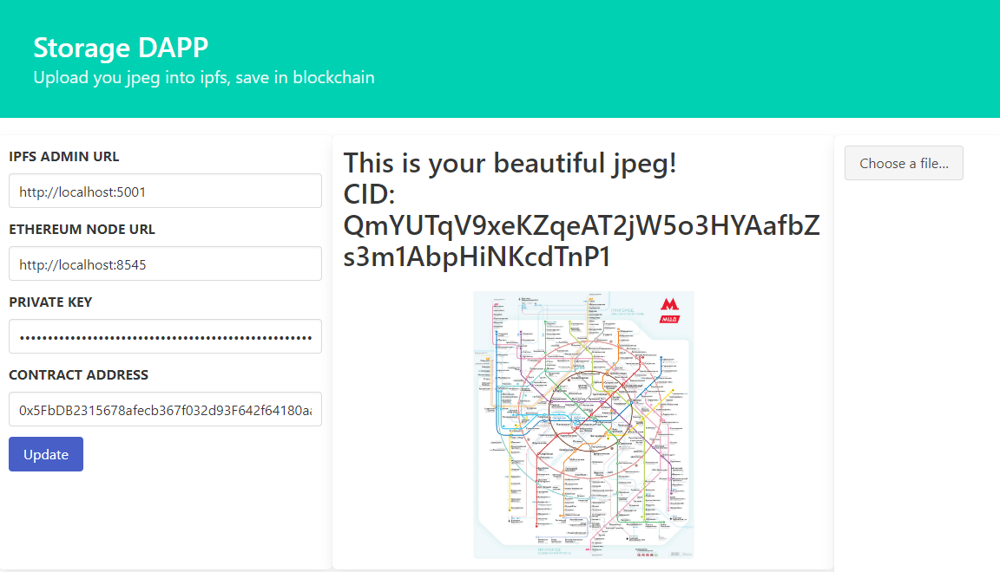
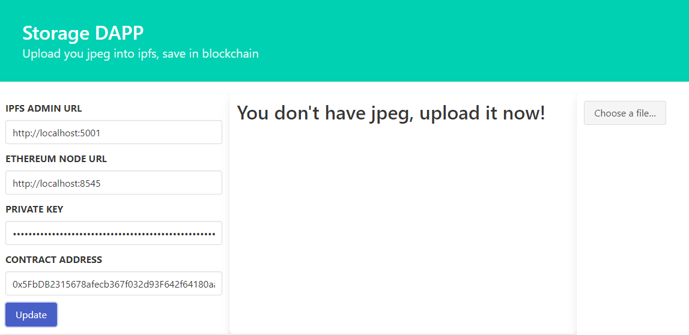

# Storage IPFS DAPP
Contract storage is optimized as stores only bytes32 sha256 of file.

## Deploy
```shell
docker compose up
```
It will deploy local hardhat node & ipfs kubo node in containers.
Also it uploads frontend right into this ipfs node.

So after deploy you will something like this.
```
hw8-ipfs-1           | added QmYvPgP1sEuCGMo8p9tEsyqpzc4amrtjtZjYjUsVKAXosH frontend/app

hw8-ethereum_node-1  | Account #0: 0xf39Fd6e51aad88F6F4ce6aB8827279cffFb92266 (10000 ETH)
hw8-ethereum_node-1  | Private Key: 0xac0974bec39a17e36ba4a6b4d238ff944bacb478cbed5efcae784d7bf4f2ff80
hw8-ethereum_node-1  | Storage deployed to 0x5FbDB2315678afecb367f032d93F642f64180aa3
```

You can go to 8080 with frontend url and use the app with details from log.

Warning! Don't deploy this in public networks as it exposes admin port of kubo.

## Run contract tests

```
npx harhat test
```

```
  Storage
    √ Put & get (2335ms)
    √ Two puts & gets (171ms)
    √ Rewrite (174ms)


  3 passing (3s)
```

## Screenshots


